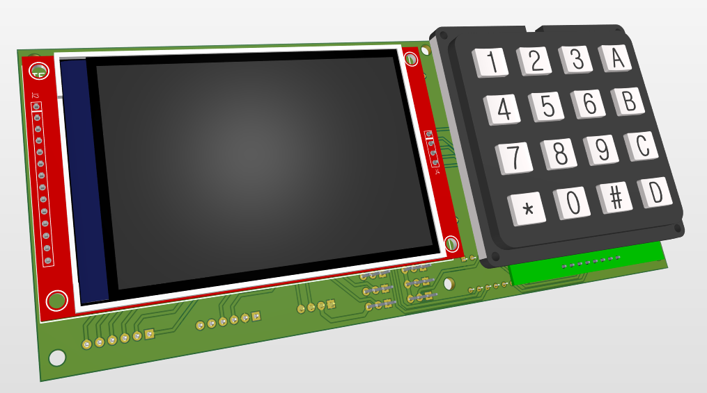
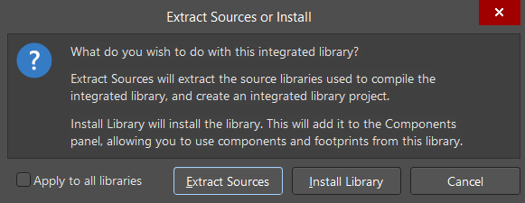
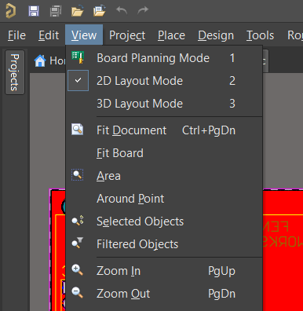

# AltiumLib - Custom Altium Designer Integrated PCB Library With 3D Models

## Overview

This repository contains a custom Altium Designer integrated library, focusing on breakout modules for easy PCB design. The library is designed with the following considerations specific to the Indonesian electronics ecosystem:

1. **Limited Availability of Chips:** In Indonesia, it's often challenging to find individual chips for sale, with most offerings being pre-packaged modules. Additionally, these modules can sometimes be more cost-effective than purchasing individual chips.

2. **Reduced Need for Support Components:** Using modules eliminates the need to add supporting components such as capacitors, resistors, or oscillators, as these are already integrated into the modules.

3. **Challenges in PCB Fabrication:** The current state of PCB fabrication in Indonesia may not fully support the production of small SMD components. Using modules circumvents this limitation, allowing for PCB manufacturing in the country.

4. **Simplicity and Speed:** The modular approach simplifies and expedites the design process. With ready-to-use modules, connections are straightforward, facilitating quick integration with microcontrollers and other devices, ultimately saving research time.

5. **Testing Certainty and Ease:** Breakout modules enable testing on a breadboard without the need for a dedicated PCB testing design. This not only streamlines the testing process but also reduces the risk of design errors, contributing to faster development.

## Why Breakout Modules?

Using breakout modules in PCB designs, especially for prototyping projects, offers several advantages:

- **Simplified Connections:** Modules provide easy-to-use connections, minimizing the complexity of wiring.

- **Cost-Effective:** Often, the cost of modules is lower than that of individual chips, making them an economical choice.

- **Ready for Rapid Prototyping:** Modules are ready-made for immediate use, allowing for swift development and prototyping.

## 3D Models in the Library

All Altium Designer libraries in this repository come with 3D models. Here's why incorporating 3D models into your PCB design can be advantageous:

1. **Enhanced Component Positioning:** 3D models facilitate precise component positioning in both 2D and 3D dimensions, providing insights into component size and thickness.

2. **Enclosure Design Simplification:** A complete PCB design with 3D models for each component simplifies the process of designing enclosures or mounting solutions for your project or product.

3. **Reduced Orientation Errors:** Previewing 3D models helps minimize orientation errors, such as misaligned ports or components placed too closely, ensuring easier component placement.

## Footprint and 3D Model Sources

The footprints for the components are sourced from various reliable platforms, including:

- [SnapEDA](https://www.snapeda.com/)
- [Component Search Engine](https://componentsearchengine.com/)
- [SamaCsys](https://www.samacsys.com/)

For 3D models, I frequently utilize [GrabCAD](https://grabcad.com/). You can check my GrabCAD account [here](https://grabcad.com/ahmad.aziz-15) for additional details.

## Installation

There are several ways to install the library. This is the easiest way to install the library:

1. Clone this repository to your local machine.
2. Go to component libraries folder. e.g. `AltiumLib/7segment/`.
3. Open the Project Outputs Folder. e.g. `AltiumLib/7segment/Project Outputs for 7segment/`.
4. Open the .IntLib file. e.g. `AltiumLib/7segment/Project Outputs for 7segment/7segment.IntLib`.
5. Altium Designer will open and ask you to install the library. Click Install.

    

6. The library is now installed and ready to use.

## Viewing in 3D

To take advantage of the 3D models included in this library, follow these steps to switch to 3D view in Altium Designer:

1. **Open Your PCB Design:**
   - Open your Altium Designer project containing the PCB design.

2. **Switch to PCB Editor:**
   - If you are not already in the PCB editor, switch to it by selecting the "PCB" tab.

3. **View Mode In Altium Designer**
    - There are 3 view modes in Altium Designer: Board planning, 2D, and 3D mode. You can switch between these modes using the "View" menu or the "2D/3D" button/icon.

4. **Activate 3D View:**
   - In the PCB editor, locate the toolbar at the top of the screen.
   - Look for the "View" menu or a dedicated "3D" button/icon.

       

   - You can also use the shortcut key "3" to toggle into 3D view, key "2" to toggle back to 2D vie, and key "1" to toggle into board planning mode.

5. **Toggle 3D View:**
   - Click on the "View" menu or the "3D" button/icon to toggle into 3D view.

6. **Explore and Navigate:**
   - Once in 3D view, explore the design by rotating, panning, and zooming to inspect component placements and orientations.

**Happy designing!**
